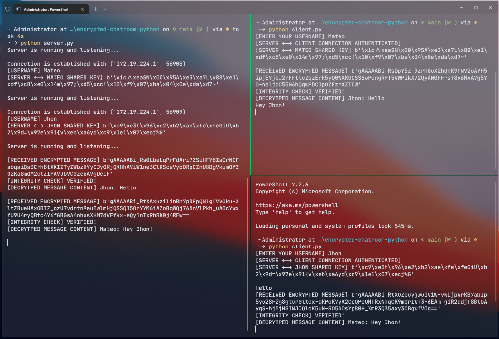

# What is encrypted chatroom?
Encrypted chatroom is a Python script that creates a server for managing multiple clients in a chat room. The script uses symmetric encryption and public-key cryptography to establish secure communication channels between the clients and the server. It imports several Python libraries, defines variables and functions, and generates private and public keys for the server. The script listens for incoming connections and handles individual clients by requesting usernames and establishing secure communication channels using the Diffie-Hellman key exchange algorithm. The clients can send encrypted messages that the server decrypts and broadcasts to all other connected clients. If a client disconnects, the server removes the client's information from its lists and closes the connection.

* Server-client authentication: ECDSA
* Key exchange: X25519
* Message authentication: SHA256

# How to start the application?
1. **Run command:** `python3 config.py`
2. **Run command:** `python3 server.py`
3. **Run command:** `python3 client.py`

# Sneak peek

